# Miniclaw Feature Tracker

This document provides a high-level, progressively updated architecture map of the Miniclaw daemon and harness. It illustrates the currently implemented features, separation of concerns, and data flow.

## System Architecture

```mermaid
graph TD
    %% =============================================
    %% CLI Layer
    %% =============================================
    subgraph CLI ["🖥️ CLI Interface (Commander)"]
        Index["miniclaw CLI (tsdown)"]
        GlobalErr["Global Error Handler"]
        
        Index --> GatewayCmd["gateway command"]
        Index --> OnboardCmd["onboard command"]
        Index --> AgentCmd["agent command"]
        
        GatewayCmd -.->|"Catches & Handles"| GlobalErr
        OnboardCmd -.->|"Catches & Handles"| GlobalErr
        AgentCmd -.->|"Catches & Handles"| GlobalErr
    end

    %% =============================================
    %% Services Layer
    %% =============================================
    subgraph Services ["⚙️ Service Layer (Business Logic)"]
        GatewaySvc["GatewayService"]
        OnboardSvc["OnboardService"]
        AgentSvc["AgentService"]
        ConfigSvc["ConfigService<br/>(Zod + Validation)"]
        FileSystemSvc["FileSystemService<br/>(Cross-Platform)"]
        ThreadSvc["ThreadStorageService<br/>(JSONL + Compaction)"]
        ChannelReg["ChannelRegistry<br/>(Adapter Router)"]
        
        GatewayCmd -->|"Instantiates"| GatewaySvc
        OnboardCmd -->|"Instantiates"| OnboardSvc
        AgentCmd -->|"Instantiates"| AgentSvc
        
        GatewaySvc -->|"Uses"| ConfigSvc
        GatewaySvc -->|"Uses"| ChannelReg
        AgentSvc -->|"Uses"| ConfigSvc
        AgentSvc -->|"Uses"| ChannelReg
        OnboardSvc -->|"Uses"| ConfigSvc
        OnboardSvc -->|"Uses"| FileSystemSvc
        ConfigSvc -->|"Uses"| FileSystemSvc
        ThreadSvc -->|"Uses"| FileSystemSvc
        ThreadSvc -->|"Uses"| ConfigSvc
    end

    %% =============================================
    %% Core Infrastructure
    %% =============================================
    subgraph Core ["🔧 Core Infrastructure"]
        Bus["MessageBus<br/>(EventEmitter)"]
        Logger["Logger (Pino + pino-pretty)"]
        
        GatewaySvc -->|"Initializes"| Bus
        Services -.->|"All services log to"| Logger
    end

    %% =============================================
    %% Channel Adapters Layer
    %% =============================================
    subgraph Channels ["📡 Channel Adapters"]
        CliCh["CliChannel<br/>(readline)"]
        SseCh["SseChannel<br/>(REST + SSE)"]
        TgCh["TelegramChannel<br/>(Grammy)"]
        
        ChannelReg -->|"Registers"| CliCh & SseCh & TgCh
        CliCh & SseCh & TgCh <-->|"Pub/Sub"| Bus
    end

    %% =============================================
    %% Gateway & API Layer
    %% =============================================
    subgraph API ["🌐 API Runtime (Hono)"]
        HonoApp["Hono Server"]
        Health["Health Check<br/>(/api/health)"]
        
        GatewaySvc -->|"Boots"| HonoApp
        HonoApp --> Health
        
        SseCh -->|"Mounts /stream, /chat"| HonoApp
    end

    %% =============================================
    %% File System Layer
    %% =============================================
    subgraph FS ["📁 File System (.miniclaw)"]
        MiniclawDir[".miniclaw/ (Root)"]
        ConfigJSON["config.json"]
        ThreadsDir["threads/ (History)"]
        WorkspaceDir["workspace/ (Sandbox)"]
        
        MiniclawDir --- ConfigJSON
        MiniclawDir --- ThreadsDir
        MiniclawDir --- WorkspaceDir
        
        ConfigSvc <-->|"Read/Write"| ConfigJSON
        OnboardSvc -->|"Scaffolds"| ThreadsDir
        OnboardSvc -->|"Scaffolds"| WorkspaceDir
        ThreadSvc <-->|"JSONL Read/Append"| ThreadsDir
    end

    %% =============== Styling ===================
    classDef cli fill:#1e3a8a, color:#fff, stroke:#60a5fa, stroke-width:3px, font-weight:bold;
    classDef svc fill:#166534, color:#fff, stroke:#4ade80, stroke-width:3px;
    classDef core fill:#4338ca, color:#fff, stroke:#818cf8, stroke-width:3px;
    classDef api fill:#9f1239, color:#fff, stroke:#fb7185, stroke-width:3px;
    classDef fs fill:#44403c, color:#f5f5f4, stroke:#d6d3d1, stroke-width:3px;

    classDef ch fill:#9d174d, color:#fff, stroke:#f43f5e, stroke-width:3px;

    class Index,GatewayCmd,OnboardCmd,AgentCmd,GlobalErr cli;
    class GatewaySvc,OnboardSvc,AgentSvc,ConfigSvc,FileSystemSvc,ThreadSvc,ChannelReg svc;
    class Bus,Logger core;
    class CliCh,SseCh,TgCh ch;
    class HonoApp,Health api;
    class MiniclawDir,ConfigJSON,ThreadsDir,WorkspaceDir fs;
```

## Implemented Feature Checklist

- **CLI Shell**: `commander` router with globally abstracted error handling.
- **Build System**: `tsdown` (Rolldown/Vite) outputting an ultra-fast, extensionless native `.mjs` ESM bundle.
- **Service Isolation**: Clean separation of `OnboardService`, `GatewayService`, `ConfigService`, and `ThreadStorageService`.
- **Cross-Platform FS**: `FileSystemService` with dynamic environment detection (`import.meta.url`) and native OS support (`os.homedir()`).
- **Intelligent Config**: Automatic relative path resolution bound natively to the dynamic `.`+`appName` working directory, validated via `zod`.
- **Thread Persistence**: Single conversation thread (all channels merge) + ephemeral system threads. JSONL append-only storage, atomic writes, `gpt-tokenizer` token estimation, auto-compaction trigger with tool-call-pending deferral.
- **Channel Registry**: Standardized `Channel` adapter interface with active implementations for CLI (`readline`), SSE (REST + Hono SSE stream), and Telegram (`grammy` with debounce streaming).
- **Logging**: Synchronous `pino-pretty` preventing TTY overlaps with interactive prompts (`inquirer`).
- **Communication Bus**: High-performance, decoupled `MessageBus` (EventEmitter) with `ThreadMessage` types aligned to pi-agent-core.
- **API Server**: Fast `hono/node-server` exposing a REST health check and dynamic channel endpoints.

## Upcoming Milestones

*(To be mapped into the architecture diagram as they are built)*

- [x] **Persistence Layer**: JSON and JSONL based storing for easy access and human-readability on personal computers.
- [x] **Channel Registry**: Formalized channel adapters (Telegram, SSE, CLI) with ingress/egress event routing.
- [ ] **Agent Core**: LLM Loop Orchestration and Provider Interface (OpenRouter, local models).
- [ ] **Compaction Service**: LLM-powered summarization for conversation thread compaction.
- [ ] **Tools & Abilities**: FS Sandbox tools interacting with `.miniclaw/workspace/`.
