# Miniclaw Feature Tracker

This document provides a high-level, progressively updated architecture map of the Miniclaw daemon and harness. It illustrates the currently implemented features, separation of concerns, and data flow.

## System Architecture

```mermaid
graph TD
    %% =============================================
    %% CLI Layer
    %% =============================================
    subgraph CLI ["🖥️ CLI Interface (Commander)"]
        Index["miniclaw CLI (tsdown)"]
        GlobalErr["Global Error Handler"]
        
        Index --> GatewayCmd["gateway command"]
        Index --> OnboardCmd["onboard command"]
        Index --> AgentCmd["agent command"]
        
        GatewayCmd -.->|"Catches & Handles"| GlobalErr
        OnboardCmd -.->|"Catches & Handles"| GlobalErr
        AgentCmd -.->|"Catches & Handles"| GlobalErr
    end

    %% =============================================
    %% Services Layer
    %% =============================================
    subgraph Services ["⚙️ Service Layer (Business Logic)"]
        GatewaySvc["GatewayService"]
        OnboardSvc["OnboardService"]
        AgentSvc["CliAgentService"]
        ConfigSvc["ConfigService<br/>(Zod + Validation)"]
        ThreadSvc["PersistenceService<br/>(JSONL + Compaction)"]
        TaskSvc["TaskService<br/>(TASKS.md Active + Archive)"]
        ProfileSvc["UserProfileService<br/>(USER.md Managed Profile)"]
        ProgressSvc["TaskProgressNotifier<br/>(Status Post + Edit Flow)"]
        ChannelReg["ChannelRegistry<br/>(Adapter Router)"]
        PathsUtil["Paths Utility<br/>(Cross-Platform)"]

        GatewayCmd -->|"Instantiates"| GatewaySvc
        OnboardCmd -->|"Instantiates"| OnboardSvc
        AgentCmd -->|"Instantiates"| AgentSvc

        GatewaySvc -->|"Uses"| ConfigSvc
        GatewaySvc -->|"Uses"| ChannelReg
        AgentSvc -->|"Uses"| ConfigSvc
        AgentSvc -->|"Uses"| ChannelReg
        AgentSvc -->|"Uses"| TaskSvc
        AgentSvc -->|"Uses"| ProfileSvc
        AgentSvc -->|"Uses"| ProgressSvc
        OnboardSvc -->|"Uses"| ConfigSvc
        ConfigSvc -->|"Uses"| PathsUtil
        ThreadSvc -->|"Uses"| PathsUtil
        ThreadSvc -->|"Uses"| ConfigSvc
        TaskSvc -->|"Uses"| PathsUtil
        ProfileSvc -->|"Uses"| PathsUtil
    end

    %% =============================================
    %% Core Infrastructure
    %% =============================================
    subgraph Core ["🔧 Core Infrastructure"]
        Bus["MessageBus<br/>(EventEmitter)"]
        Logger["Logger (Pino + pino-pretty)"]
        
        GatewaySvc -->|"Initializes"| Bus
        Services -.->|"All services log to"| Logger
    end

    %% =============================================
    %% Channel Adapters Layer
    %% =============================================
    subgraph Channels ["📡 Channel Adapters"]
        CliCh["CliChannel<br/>(readline)"]
        TgCh["TelegramChannel<br/>(Grammy)"]
        
        ChannelReg -->|"Registers"| CliCh & TgCh
        CliCh & TgCh <-->|"Pub/Sub"| Bus
    end

    %% =============================================
    %% Gateway & API Layer
    %% =============================================
    subgraph API ["🌐 API Runtime (Hono)"]
        HonoApp["Hono Server"]
        Health["Health Check<br/>(/api/health)"]
        Ingress["Message Ingress<br/>(/api/messages)"]
        
        GatewaySvc -->|"Boots"| HonoApp
        HonoApp --> Health
        HonoApp --> Ingress
    end

    %% =============================================
    %% Agent Runtime
    %% =============================================
    subgraph AgentRuntime ["🤖 Agent Runtime"]
        AgentLoop["AgentLoop"]
        SkillTools["Skill Tools<br/>(list/load/info)"]
        TaskTools["Task Tools<br/>(list/create/update/archive)"]
        ProfileTools["Profile Tools<br/>(read/update)"]
        SkillsLoader["SkillsLoader"]

        GatewaySvc -->|"Starts"| AgentLoop
        AgentSvc -->|"Starts"| AgentLoop
        AgentLoop -->|"Uses"| SkillTools
        AgentLoop -->|"Uses"| TaskTools
        AgentLoop -->|"Uses"| ProfileTools
        SkillTools -->|"Backed by"| SkillsLoader
        TaskTools -->|"Backed by"| TaskSvc
        ProfileTools -->|"Backed by"| ProfileSvc
    end

    %% =============================================
    %% File System Layer
    %% =============================================
    subgraph FS ["📁 File System (.miniclaw)"]
        MiniclawDir[".miniclaw/ (Root)"]
        ConfigJSON["config.json"]
        ThreadsDir["threads/ (History)"]
        WorkspaceDir["workspace/ (Sandbox)"]
        TasksMD["TASKS.md"]
        UserMD["USER.md"]
        
        MiniclawDir --- ConfigJSON
        MiniclawDir --- ThreadsDir
        MiniclawDir --- WorkspaceDir
        MiniclawDir --- TasksMD
        MiniclawDir --- UserMD
        
        ConfigSvc <-->|"Read/Write"| ConfigJSON
        OnboardSvc -->|"Scaffolds"| ThreadsDir
        OnboardSvc -->|"Scaffolds"| WorkspaceDir
        OnboardSvc -->|"Scaffolds"| TasksMD
        OnboardSvc -->|"Scaffolds"| UserMD
        ThreadSvc <-->|"JSONL Read/Append"| ThreadsDir
        TaskSvc <-->|"Managed Markdown"| TasksMD
        ProfileSvc <-->|"Managed Markdown"| UserMD
    end

    %% =============== Styling ===================
    classDef cli fill:#1e3a8a, color:#fff, stroke:#60a5fa, stroke-width:3px, font-weight:bold;
    classDef svc fill:#166534, color:#fff, stroke:#4ade80, stroke-width:3px;
    classDef core fill:#4338ca, color:#fff, stroke:#818cf8, stroke-width:3px;
    classDef api fill:#9f1239, color:#fff, stroke:#fb7185, stroke-width:3px;
    classDef fs fill:#44403c, color:#f5f5f4, stroke:#d6d3d1, stroke-width:3px;

    classDef ch fill:#9d174d, color:#fff, stroke:#f43f5e, stroke-width:3px;

    class Index,GatewayCmd,OnboardCmd,AgentCmd,GlobalErr cli;
    class GatewaySvc,OnboardSvc,AgentSvc,ConfigSvc,ThreadSvc,TaskSvc,ProfileSvc,ProgressSvc,ChannelReg,PathsUtil svc;
    class Bus,Logger core;
    class CliCh,TgCh ch;
    class HonoApp,Health,Ingress api;
    class MiniclawDir,ConfigJSON,ThreadsDir,WorkspaceDir,TasksMD,UserMD fs;
```

## Implemented Feature Checklist

- **CLI Shell**: `commander` router with globally abstracted error handling.
- **Build System**: `tsdown` (Rolldown/Vite) outputting an ultra-fast, extensionless native `.mjs` ESM bundle.
- **Service Isolation**: Clean separation of `OnboardService`, `GatewayService`, `ConfigService`, `PersistenceService`, `CliAgentService`, `TaskService`, and `UserProfileService`.
- **Cross-Platform Paths**: Centralized `paths` utility with dynamic environment detection (`import.meta.url`) and native OS support (`os.homedir()`).
- **Intelligent Config**: Automatic relative path resolution bound natively to the dynamic `.`+`appName` working directory, validated via `zod`.
- **Thread Persistence**: Single conversation thread (all channels merge) + ephemeral system threads. Type-based folder naming (`conversation/`, `system/`), JSONL append-only storage, atomic writes, `gpt-tokenizer` token estimation, auto-compaction trigger with transient task/skill tool chatter stripped before persistence.
- **Channel Registry**: Standardized `Channel` adapter interface with active implementations for CLI (`readline`) and Telegram (`grammy` with streamed updates and edit-aware task progress).
- **Logging**: Synchronous `pino-pretty` preventing TTY overlaps with interactive prompts (`inquirer`).
- **Communication Bus**: High-performance, decoupled `MessageBus` (EventEmitter) with `ThreadMessage` types aligned to pi-agent-core.
- **API Server**: Fast `hono/node-server` exposing a trimmed health check and generic message ingress surface.
- **LLM Provider Support**: Multi-provider support with OpenAI, Anthropic, Ollama, and NVIDIA APIs. Dictionary-based provider configuration for easy extensibility.
- **Channel Controls**: Per-channel enable/disable configuration with proper validation and error messaging.
- **Global Task System**: Agent-managed `TASKS.md` with `Active Jobs` and `Archived Jobs`, stable job IDs, checklist items, and structured mutation through task tools instead of freeform markdown edits.
- **Managed User Profile**: Agent-managed `USER.md` block storing onboarding preferences such as timezone, language, communication style, response length, technical level, and calendar preference.
- **Onboarding as Work**: First-run preference gathering is no longer a separate mode; the agent auto-injects an onboarding job and completes it through the standard multi-turn task workflow.
- **Skill Runtime**: Real agent tools for `list_skills`, `load_skill`, and `get_skill_info`, with loaded skill bodies scoped to the active turn instead of being persisted into history.
- **Calendar Execution Model**: The generalized calendar config/service layer has been removed. Calendar skills now provide guidance only, and the only supported execution path is `gws_calendar_agenda` plus the generic confirmation-gated tools `propose_plan` and `execute_plan`. The currently supported write plan type is `gws_calendar_insert`. `lark` remains a stored preference until a real execution path exists.

## Recent Improvements

- **Service Layer Optimization**: Removed thin wrapper services (`FileSystemService`, generalized `CalendarService`, duplicate `agent.ts`) to reduce unnecessary abstraction layers. Replaced with direct usage of standard Node.js modules, an explicit GWS calendar runtime, and centralized `paths` utility (~170 lines removed).
- **Reduced Coupling**: Eliminated unnecessary service dependencies by using direct path resolution functions (`getRootDir()`, `getConfigPath()`, `resolvePath()`) instead of service injection.
- **Thread Naming**: Migrated from ULID-based thread IDs to type-based folder names (`conversation/`, `system/`) for clearer file system organization.
- **Provider Configuration**: Refactored provider resolution to use dictionaries instead of if-else chains, making it easier to add new providers.
- **CLI Channel Validation**: Added disabled check for CLI channel with clear error messaging when attempting to use disabled channels.
- **Runtime Reliability Coverage**: Added direct tests for persistence, agent loop orchestration, gateway wiring, Telegram streaming/edit fallbacks, task services, and task tools, with coverage gates focused on real runtime surfaces.
- **SSE Removal**: Removed the SSE channel and `/api/sse/*` routes to focus the runtime on CLI and Telegram plus thin HTTP ingress.
- **Task-Oriented Agent State**: Added `TASKS.md`, structured task tooling, task progress notification/edit flows, and archived-job retention instead of deleting finished work.
- **Profile-Driven Onboarding**: Added managed `USER.md` profile state and onboarding job injection so the agent can gather preferences through the same normal planning loop it uses for other long-horizon work.
- **Skill-Directed Calendar Flow**: Calendar skills now handle discovery and operating guidance, while execution goes through the explicit GWS agenda tool plus generic proposal/confirm plan tools instead of a generalized provider runtime.

## Upcoming Milestones

*(To be mapped into the architecture diagram as they are built)*

- [x] **Persistence Layer**: JSON and JSONL based storing for easy access and human-readability on personal computers.
- [x] **Channel Registry**: Formalized channel adapters (Telegram and CLI) with ingress/egress event routing.
- [x] **Agent Core**: LLM Loop Orchestration and Provider Interface (OpenAI, Anthropic, Ollama, NVIDIA).
- [x] **Compaction Service**: LLM-powered summarization for conversation thread compaction with retry logic and token estimation.
- [x] **Task System**: Structured active/archive job tracking in `TASKS.md` with agent-facing task tools.
- [x] **User Profile**: Managed `USER.md` onboarding/profile state with auto-injected onboarding job support.
- [x] **Skill Runtime**: Real `list_skills`, `load_skill`, and `get_skill_info` tools with turn-scoped skill bodies.
- [ ] **Workspace Tools & Abilities**: FS Sandbox tools interacting with `.miniclaw/workspace/`.
- [ ] **Lark Calendar Skills**: Provider-specific skills and execution flow for Lark to match the current GWS path.
