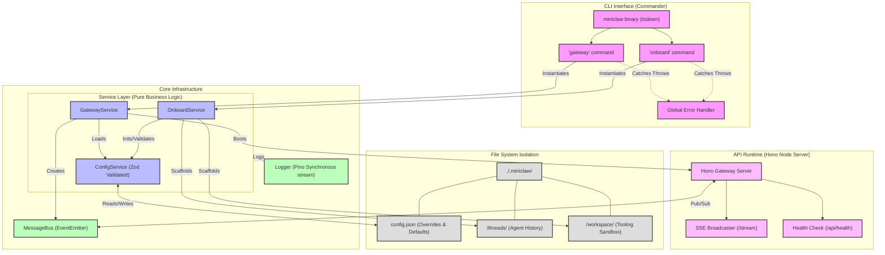

# Miniclaw Feature Tracker

This document provides a high-level, progressively updated architecture map of the Miniclaw daemon and harness. It illustrates the currently implemented features, separation of concerns, and data flow.

## System Architecture

## Implemented Feature Checklist

- **CLI Shell**: `commander` router with globally abstracted error handling.
- **Build System**: `tsdown` (Rolldown/Vite) outputting an ultra-fast, extensionless native `.mjs` ESM bundle.
- **Service Isolation**: Clean separation of `OnboardService`, `GatewayService`, and `ConfigService`.
- **Intelligent Config**: Automatic relative path resolution bound natively to the `.miniclaw/` working directory, validated via `zod`.
- **Logging**: Asynchronous-blocking `pino-pretty` preventing TTY overlaps with interactive prompts (`inquirer`).
- **Communication Bus**: High-performance, decoupled `MessageBus` (EventEmitter) ready to sync the Gateway API and the background Agent loop.
- **API Server**: Fast `hono/node-server` exposing a REST health check and an SSE (Server-Sent Events) event stream.

## Upcoming Milestones
*(To be mapped into the architecture diagram as they are built)*
- [ ] **Agent Core**: LLM Loop Orchestration and Provider Interface (OpenRouter, local models).
- [ ] **Persistence Layer**: SQLite schema + Drizzle ORM to persist the `MessageBus` to `.miniclaw/threads/`.
- [ ] **Tools & Abilities**: FS Sandbox tools interacting with `.miniclaw/workspace/`.
