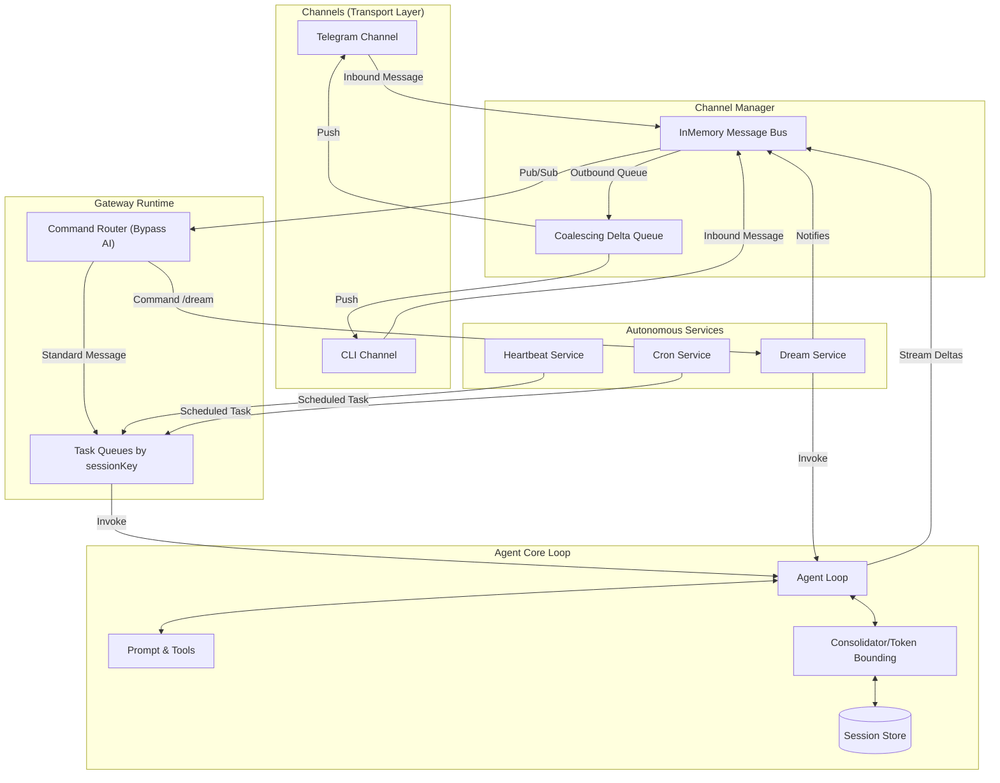

# Architecture Overview

Nanobot represents a multi-threaded, asynchronous, and streaming virtual assistant. The core goal of the architecture is to separate the concerns of *how a message gets in/out* (Transport), *how it's routed and managed* (Gateway), and *how the AI decides what to do with it* (Core Agent Loop). By strictly decoupling these layers, Nanobot can run completely autonomously.

## High-Level System Architecture

## Layers of Abstraction

### 1. Transport Layer (`src/channels/`)
The interface between the real world and the inner bot. Defines `InboundChannelMessage` and `OutboundChannelMessage`. Examples include the CLI shell and the Telegram platform. The transport layer assumes all outbound traffic might be streaming tokens (deltas) and handles assembling them appropriately for platforms that might not support real-time token streaming natively.

### 2. General Messaging Bus (`src/channels/bus.ts`)
A generic `InMemoryMessageBus` serves as the central circulatory system. It decouples the Channels from the Gateway. A channel pushes an inbound message onto the bus, oblivious to what happens next. The Gateway subscribes to the bus and pushes outbound messages back into it.

### 3. Gateway Runtime (`src/gateway/runtime.ts`)
The multiplexer. The Gateway listens to the bus, creates an isolated "Task Queue" per `sessionKey` (usually a mix of Channel ID + Chat ID), and handles instantiating an Agent. It manages state transitions—turning asynchronous stream tokens into bus messages gracefully and handling unexpected LLM aborts.

### 4. Background & Autonomy (`src/background/`, `src/dream/`, `src/cron/`)
The background services hook directly into both the Agent Loop (for offline memory management) and the Gateway queues (to pseudo-inject messages "from the system" to provoke a response). This allows the agent to spontaneously message users or compact its memories without human intervention.

### 5. Core Agent Loop (`src/agent/`)
The isolated thinking loop. It wraps the agnostic `@mariozechner/pi-agent-core` with persistence (maintaining history arrays using local files `session-store`), context shaping (compressing/tokenizing old memory via `consolidator`), and prompt building. 

## Design Philosophy for Rewrite Target

When building an intuitive and direct implementation of this architecture (e.g., ported to Python):
1. **Always funnel through the string-typed `sessionKey`**: Treat every conversation as uniquely identified by a string combining physical channel and user identifier.
2. **Push versus Pull**: Channels shouldn't wait on Agents. They chuck messages to a bus and respond to Bus events via observers.
3. **Keep the Core Loop Pure**: The `Agent` should know nothing about "Telegram". It just eats generic `Message[]` payloads and yields state deltas. All specific platform rendering (like stripping markdown for a platform) should happen at the Gateway or Channel boundaries.
4. **Token Management is a First-Class Citizen**: Don't treat memory management as an afterthought. Native lifecycle hooks (like `Consolidator` and `AutoCompactor`) must wrap the raw LLM calls to prevent context window explosion.
