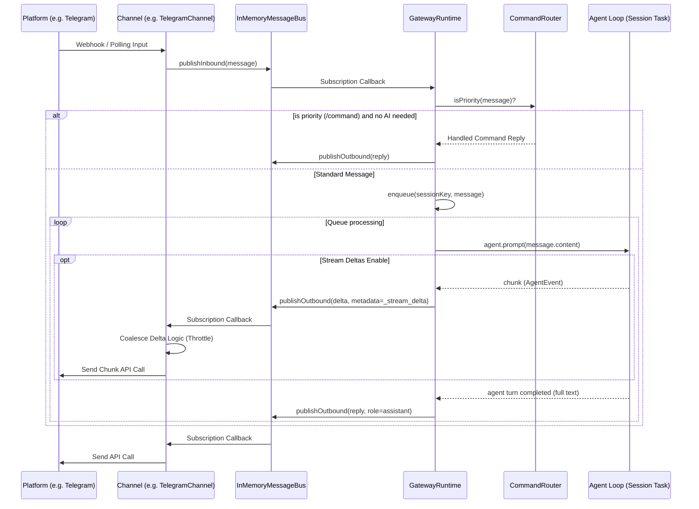

# Channels and Gateway Routing

The transport layer and gateway routing are the backbones of the Nanobot-TS architecture. They manage the inflow of external inputs (via various platforms) and safely dispatch them into discrete execution sandboxes per user, ensuring thread safety and streaming responsiveness.

## Transport & Routing Flowchart

## 1. Channels (`src/channels/`)

Channels act as the "drivers" interfacing with the outside world.
- **`BaseChannel` / `ChannelFactory`**: Abstract definitions. Each implemented channel (like Telegram) inherits from this.
- **`ChannelManager`**: Bootstraps all active channels, subscribes them to the bus, and provides bulk broadcast functions.

### Features handled natively by Channels:
- **Rate limiting / Anti-spam**: A channel may limit inbound rates to avoid hitting queue limits downstream.
- **Stream Coalescing (`coalesceOutboundMessage`)**: Important because AI platforms stream 5-10 tokens per second, but API limits on platforms like Telegram strictly cap message edits (e.g., 20 requests per minute). The `ChannelManager` throttles and coalesces these fine-grained `_stream_delta` packets into larger chunks before writing to the actual channel.
- **Retry Logic with Backoff**: Failed outbound messages hit an exponential backoff loop `[0, 100, 500]` ms natively within the manager.

## 2. In-Memory Message Bus (`src/channels/bus.ts`)

A deeply simplistic PubSub engine.
- `publishInbound` / `subscribeInbound`
- `publishOutbound` / `subscribeOutbound`

Because the `MessageBus` handles primitive internal objects (`InboundChannelMessage`, `OutboundChannelMessage`), the system remains utterly agnostic to the source structure of Telegram JSON payloads or CLI prompt structures.

## 3. Gateway Runtime (`src/gateway/runtime.ts`)

The Gateway is essentially a single massive orchestrator. It manages the lifecycle of individual active "Sessions" using a `sessionKey=channel:chatId`.

### Key Responsibilities:
1. **Task Queuing (`this.sessionChains`)**: Maintains a hash-map of JavaScript `Promises` keyed by `sessionKey`. If a user spams "Hello", "How are you", "Stop", it chains these promises sequentially so the underlying `Agent` instance doesn't process prompt #2 until prompt #1 is resolved or aborted.
2. **Agent Instantiation & Factory (`this.agents`)**: Lazily creates `GatewayRuntimeAgent` instances using `getTools()` closures and session state stores. Caches these agents in active memory.
3. **Routing to Commands (`CommandRouter`)**: Intercepts structural inputs. For example, if it detects `/clear`, it uses the `CommandRouter` to bypass the `agent.prompt` and directly hit the `Agent.abort()` and `sessionStore.clear()` methods without costing LLM tokens.
4. **Subscription Transformation**: Maps `AgentEvent` streams (the internal structural tool executions and message chunks) into `OutboundChannelMessage` streams that channels understand. Adds metadata hints like `_progress: true, _tool_hint: true`.

## Porting Considerations for Miniclaws (Python)
- **Asyncio Queues:** Replace the `sessionChains` Promise map with `asyncio.Queue` per session key, wrapped within an `asyncio.Task` worker that spins up on first message and dies after an idle timeout.
- **Bus Implementation:** A simple `asyncio.Queue` or PyPubSub approach suffices for the `InMemoryMessageBus`.
- **Throttling Streaming:** Ensure the delta coalescing logic sits on the outbound dispatcher. Without it, you will rate-limit against Telegram within seconds.
