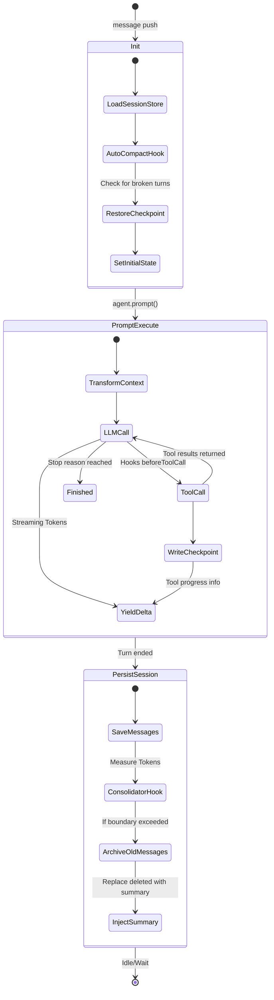

# Agent Lifecycle and State Management

The core of Nanobot's reasoning happens inside the `Agent Loop` wrapper (`src/agent/runtime.ts`), built on top of `@mariozechner/pi-agent-core`. Managing a highly autonomous, multi-turn conversational agent requires extreme care regarding context window sizes, crash recovery, and state persistence.

## Agent Turn State Chart

## 1. The Wrapper Configuration (`createSessionAgent`)

The underlying agent core only understands pure functional arrays of messages. It doesn't know what a filesystem is. `createSessionAgent` bridges this gap:
- **`sessionStore`**: A JSON/SQLite file interface maintaining message histories on disk. 
- **`persistedSession`**: The raw stored document.
- **`transformContext` hook**: Crucial! Before the core agent calls the LLM, the wrapper rewrites the message history context dynamically. If the `Consolidator` previously archived old conversational chunks, this hook injects a synthetic `user` block containing `## Previous idle-session summary\n...` at the very beginning of the prompt to restore lost context safely within bounds.

## 2. Checkpoints & Crash Recovery (`session-persistence.ts`)

Because LLMs can produce structured output containing parallel tool calls, the system might crash mid-execution (e.g. while performing a slow network request inside a tool). 
- **`createRuntimeCheckpoint`**: Every time an agent yields a message delta or finishes a tool call, we serialize the exact cursor state (completed tool calls vs pending tool calls) into the `metadata` field of the session store.
- **`restoreRuntimeCheckpoint`**: On the very next launch, if `metadata.runtimeCheckpoint` exists and the last message from the LLM was abruptly cut off without a valid `stopReason`, the wrapper will slice off the damaged payload and restore valid completed tools, effectively allowing the agent to "pick up where it left off" transparently.

## 3. The `Consolidator` (`consolidator.ts`)

LLMs have finite sequence limits (`contextWindowTokens`). A naive chat bot simply drops the oldest N messages. Nanobot uses a semantic Consolidator.
- **`maybeConsolidateByTokens`**: Ran *after* every completed agent turn. It counts the tokens. If the prompt exceeded the configured soft limit, it takes the oldest chunk of N messages and summarizes them using the LLM itself.
- **`lastConsolidated`**: A pointer inside the `SessionRecord`. Marks the threshold of messages that have been structurally converted to a summary. Messages before this index are hidden from `transformContext`, preventing them from eating context space.

## 4. The `AutoCompactor` (`auto-compact.ts`)

Ran at the *start* of the initialization loop.
- Focuses on chronological gaps rather than token usage. 
- "Idle Session Cleanup": If a chat session hasn't received a message in `X` hours, the psychological "context" of that human conversation is over. The `AutoCompactor` compresses the *entire* historical log into a single structured summary, archives the raw messages to long-term memory, and gives the LLM a clean slate for the "next day" (with the summary pinned to the context block).

## Implementation in Python (Miniclaw)

When porting this module:
1. **Pydantic**: Use Python's Pydantic to tightly schema the `SessionRecord`, enforcing the `lastConsolidated` index tracking strongly.
2. **Persistence**: In Python, an `aiosqlite` backend is vastly safer and more robust than raw JSON file reads/writes, especially considering async file locking issues on some operating systems.
3. **Pipelining Hooks**: Ensure that the core LLM execution engine has explicit `before_llm_call()` and `after_llm_call()` interceptors so `transformContext` and `Consolidator` triggers inject seamlessly without modifying the core reasoning engine.
