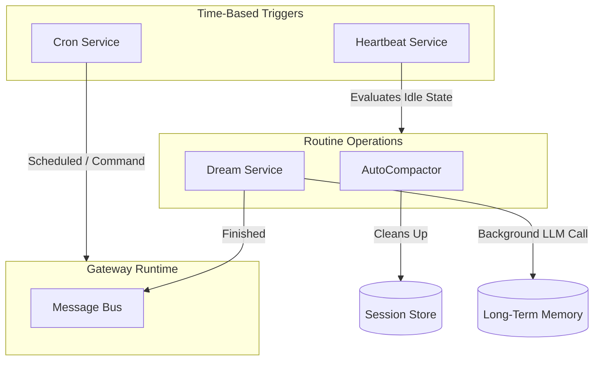

# Background and Autonomy Services

A key differentiator between a standard "chat bot" and an "agent" is unprompted behavior. Nanobot implements several daemon services that constantly monitor the system, perform garbage collection, and proactively engage the user.

## Background Services Architecture

### 1. The Dream Service (`src/dream/`)

The `DreamService` mimics human sleep cycles. It runs highly expensive, slow LLM operations in the background without blocking the user interface.
- **Trigger**: Called manually via `/dream` (intercepted by `CommandRouter`) or triggered via periodic background loops.
- **Function**: Scans all recent transient context (from the auto-compactor or fresh messages). It runs an extraction LLM prompt looking for "facts", "preferences", or "todo items", and inserts them into the long-term semantic search vector database (`MemoryStore`).
- **Notification**: When it completes, it injects a pseudo-message onto the MessageBus (`"Dream completed in 45s. Added 3 facts."`) bridging the gap back to the user to let them know the unprompted action occurred.

### 2. The Auto-Compactor (`src/agent/auto-compact.ts`)

While the `Consolidator` saves you from hitting the raw token limit of the model *during* a conversation, the `AutoCompactor` resets conversations periodically.
- Because tokens are expensive, keeping a conversation active for 4 days is wasteful if the topic changed completely.
- Periodically checks the `lastUpdatedAt` timestamp of `SessionRecords`. If `idle > N minutes`, it invokes a background summarization agent, archives the history, saves the summary as a preamble, and effectively wipes the slate clean (saving thousands of context tokens).

### 3. Cron & Heartbeat (`src/cron/`, `src/heartbeat/`)

These services wrap `node-cron` or `setInterval` style loops.
- They periodically wake up, find the most recently active non-internal channel (using `pickRecentChannelTarget`), and can initiate proactive interactions. 
- Example: "Good morning! I see you have 3 meetings today on your calendar."
- Handled safely by creating fake `InboundChannelMessage` payloads with specific internal tags (`_cron: true`) and pushing them into the standard Gateway Runtime queue. The `Agent` processes it like normal chatter but understands it was self-provoked.

## Implementation in Python (Miniclaw)

When porting background autonomy into Python:
1. Use `asyncio` background tasks initialized at startup. Do **not** use separate blocking OS threads unless absolutely necessary (like heavy text embedding/vector math for memory). For I/O bound LLM calls, `asyncio.create_task()` works perfectly.
2. Structure the `Dream` operations as a completely decoupled consumer. It should read from a SQLite table of "unprocessed facts" and write to a "memory" table independent of the actual chat `session_store.sqlite`.
3. In Python, `APScheduler` is an excellent drop-in replacement for complex cron tracking, offering async execution and SQLite job persistence.
